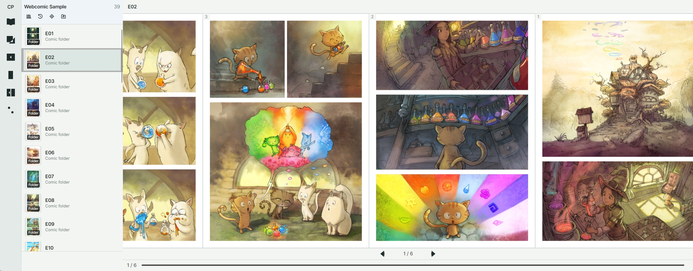

# ComicPlate

[中文 README](README.md) / [日本語 README](README_JA.md)

ComicPlate is a lightweight local comic reader for Windows and macOS, built with C# and Avalonia.

It opens local folders and comic archives as readable books, restores reading progress, and does not touch the user's original files.

**Current public version:** 1.0.1



Sample comic pages: *Pepper&Carrot* by David Revoy, licensed under CC BY 4.0.

## Status

1.0.0 is the first complete public release.

The app is distributed as self-contained builds for now, not as installers. Windows and macOS installers, signing, and a fuller release flow will be refined in later versions.

## Supported platforms

Current release targets:

* Windows x64
* macOS Apple Silicon

## Features

* Open local folders, ZIP / CBZ, and RAR / CBR archives.
* Open a single image as a lightweight preview.
* Single-page and double-page reading.
* Right-to-left and left-to-right reading directions.
* Horizontal continuous reading strip with keyboard, button, wheel, and drag controls.
* Context Shelf for current-container navigation.
* Continue Reading and per-book progress restore.
* Multiple windows, fullscreen, and auto-hidden toolbar in fullscreen.
* Built-in light, dark, and reader-friendly color themes.
* Chinese, English, and Japanese UI.
* Explicit settings for Windows file associations and Explorer context menu entries.

## Scope

ComicPlate is a reader, not a library manager.

It reads user content, builds a page list, displays it, and saves ComicPlate-owned state such as settings, session, progress, logs, and cache.

It can remember reading position, restore window state, save language and theme preferences, and register supported file associations or context menu entries when the user explicitly chooses to do so.

It must not delete, move, rename, rewrite, or edit user comic files.

## Supported formats

ComicPlate can open:

* Folder images
* `.zip` / `.cbz`
* `.rar` / `.cbr`
* `.jpg` / `.jpeg`
* `.png`
* `.webp`
* `.bmp`
* `.gif` first frame only

Not in scope:

* PDF
* EPUB / MOBI
* Video / audio
* Nested archives
* 7z / CB7
* Metadata management
* Full-library scanning
* File editing or file management actions

## UI model

ComicPlate starts with a small entry screen, then moves into the reader window.

The reader window has a left Context Shelf, a central Reader Stage, and a bottom progress bar. The Shelf is only for nearby navigation inside the current container. It is not a bookshelf.

The settings window only controls ComicPlate's own behavior, such as language, theme, reading preferences, data folder, file associations, and shortcut reference. It is not a file manager.

## Run from source

Requirements:

* .NET SDK

```bash
dotnet restore
dotnet run --project src/ComicPlate.App
```

Debug configuration:

```bash
dotnet run --project src/ComicPlate.App -c Debug
```

## Build

Basic Release publish:

```bash
dotnet publish src/ComicPlate.App -c Release
```

macOS app bundle script:

```bash
bash scripts/package-macos-app.sh
```

Release outputs are self-contained builds. Build outputs should stay outside Git. Use `artifacts/`, `publish/`, or other ignored output folders.

## Project layout

```text
src/ComicPlate.App             Avalonia UI, windows, views, view models
src/ComicPlate.Core            Book, Page, reading state, sorting, domain rules
src/ComicPlate.Infrastructure  File system, archives, persistence, platform services
tests/                         Tests
platform/                      Platform-specific files
scripts/                       Build and packaging scripts
```

## Architecture

ComicPlate uses a small App / Core / Infrastructure split.

```text
App             Avalonia UI, windows, views, view models
Core            Book, Page, reading state, sorting, domain rules
Infrastructure  File system, archives, persistence, platform services
```

The reader should not decode the whole book at once. Image decode, cache, and memory behavior are treated as part of the reading core, not as a later polish step.

## Roadmap

Near-term work:

* Refine release packaging for Windows and macOS.
* Improve file association, signing, and platform integration.
* Continue improving image decode, cache, and memory behavior.
* Tighten reading interaction and settings based on real use.

## Boundaries

ComicPlate is not a PDF reader, EPUB reader, image editor, metadata editor, batch rename tool, file manager, or full library manager.

## Contributing

Issues are welcome, especially for unreadable archives, wrong page order, broken image decoding, double-page layout problems, reading direction problems, platform differences, memory issues, and performance issues.

Large feature PRs should start with an issue first.

Core rule: ComicPlate should not modify user comic files or turn into a library manager.

## License

See [LICENSE](LICENSE).
